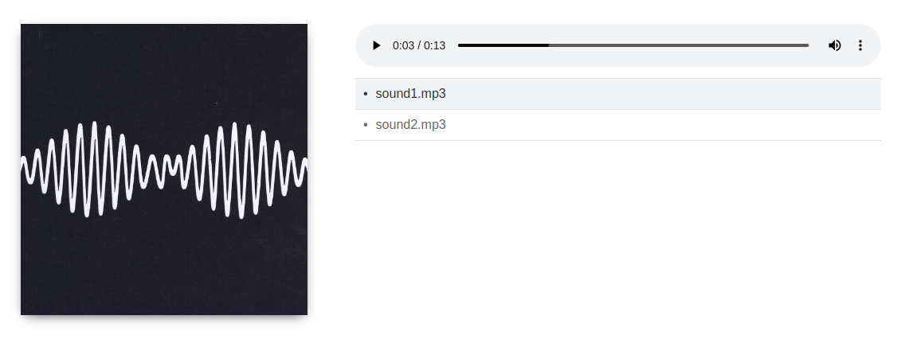
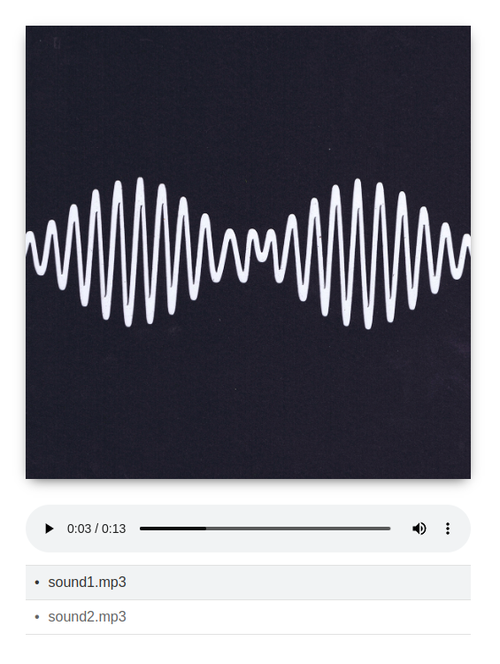

# PHP Single File Audio Player
Simple HTML5 audio player for mp3, webm, ogg and wav files which includes all CSS and JS in one PHP file

## Project structure
* `/src`: project source
* `/demo`: responsive demo with 2 sound files and a cover art picture
* `/screenshots`: pictures taken from the demo

## Usage
1. Create a new folder on your webserver
2. Copy `src/standalone.php` into that folder (optional:) and rename it `index.php`
3. (Optional) create a cover image called `cover.png` and place it inside the folder
4. Create a new folder `audio` in the same folder
5. Copy all your audio files inside the `audio` folder

## Screenshots

## Based on
This project is based on code and media by Code Boxx (https://code-boxx.com/simple-php-audio-player/), see COPYRIGHT_CODEBOXX for more info.